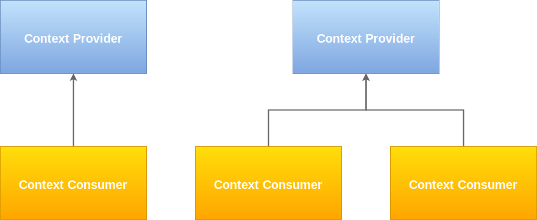

# ngx-context (a.k.a. Angular Context)

<p align="center">
  <a href="https://travis-ci.org/ng-turkey/ngx-context"></a>
  <a href="https://codeclimate.com/github/ng-turkey/ngx-context/maintainability"></a>
  <a href="https://codeclimate.com/github/ng-turkey/ngx-context/test_coverage"></a>
  <a href="https://codecov.io/gh/ng-turkey/ngx-context"></a>
  
  <a href="https://twitter.com/ngTurkiye"></a>
</p>

Angular Context is a library to bind data to deeply nested child components **without passing properties through other components or getting blocked by a router outlet**.

If you would like to have further information on why you need a library like this, you may find the [reasons](#reasons-to-use-this-library) below. Otherwise, skip to the [quickstart](#quickstart) or [usage](#usage) section.

Check [demo application](https://stackblitz.com/edit/ngx-context) out for a preview.

## Reasons to Use This Library

Data-binding and input properties are great. However, working with them has some challenges:

- Passing properties through several layers of the component tree is known as prop-drilling and it is time consuming and difficult and error prone to maintain.
- When a component is loaded via `router-outlet`, data-binding is not available and prop-drilling is no longer an option.
- Providing data through state management has its own caveat: Since connecting presentational (dumb) components directly to a specific state breaks their reusability, they have to be wrapped by container (smart) components instead and that usually is additional work.

This library is designed to improve developer experience by fixing all issues above. It provides context through dependency injection system behind-the-scenes and lets your deeply nested dumb components consume this context easily. It is conceptually influenced by [React Context](https://reactjs.org/docs/context.html), but differs in implementation and is 100% tailored for Angular.



## Quickstart

### Installation

Run the following code in your terminal:

```
yarn add ngx-context
```

or if you are using npm:

```
npm install ngx-context
```

### Setup Before Initial Use

Import `NgxContextModule` into your root module like:

```TS
import { NgxContextModule } from 'ngx-context';

@NgModule({
  imports: [ NgxContextModule ]
})
export class AppModule {}

```

### How to Provide Context from Parent Component

Simply put a `ContextProviderComponent` around the children and refer to property names to provide.

```TS
@Component({
  selector: 'parent-component',
  template: `
  <context-provider provide="someProp someOtherProp">

    <!--
    components consuming the context can be deeply nested
    within the components placed here (inside context provider)
    and be able to consume someProp and someOtherProp
    -->

  </context-provider>
  `,
})
export class ParentComponent {
  someProp: string = 'Test';

  someOtherProp: boolean = true;

  notProvided: number = 5;

  alsoNotProvided: Observable<> = empty();
}

```

### How to Consume Context in Child Component

You may consume any provided context in a component by placing a `ContextConsumerDirective` on it. This component can either be a direct or a deeply nested child of the context provider.

```HTML
<!-- child component will be able to consume all provided props -->

<child-component contextConsumer></child-component>

```

## Usage

### ContextProviderComponent

The name of the props to be provided is set by `provide` input and it can take `string` or `Array<string>` values.

```HTML
<context-provider provide="someProp someOtherProp">
  <!-- consumers will consume someProp and someOtherProp -->
</context-provider>

```

— or —

```HTML
<context-provider [provide]="['someProp', 'someOtherProp']">
  <!-- consumers will consume someProp and someOtherProp -->
</context-provider>

```

Provided property names can be dynamically set.

```HTML
<context-provider [provide]="propertiesToProvide">
  <!-- consumers will consume properties defined by propertiesToProvide -->
</context-provider>

```

Provided property names can be mapped.

```HTML
<context-provider
  provide="someProp"
  [contextMap]="{someProp: 'someOtherPropName'}"
>
  <!-- consumers will consume someOtherPropName -->
</context-provider>

```

Context consumers or their parents should be wrapped by `ContextProviderComponent` in the parent component.

```HTML
<context-provider provide="someProp someOtherProp">
  <some-context-consumer></some-context-consumer>
  <some-other-context-consumer></some-other-context-consumer>
  <parent-of-context-consumer></parent-of-context-consumer>
  <grand-grand-grand-parent-of-context-consumer></grand-grand-grand-parent-of-context-consumer>
</context-provider>

```

More than one `ContextProviderComponent` can be placed in a parent component.

```HTML
<context-provider provide="someProp someOtherProp">
  <some-context-consumer></some-context-consumer>
  <parent-of-context-consumer></parent-of-context-consumer>
</context-provider>

<context-provider provide="yetAnotherProp">
  <some-other-context-consumer></some-other-context-consumer>
</context-provider>

```

Router outlets have no effect on context and can be safely used.

```HTML
<context-provider provide="someProp someOtherProp">
  <router-outlet></router-outlet>
</context-provider>

```

### ContextConsumerComponent

The easiest way to consume a context is to place a `ContextConsumerComponent` inside a child component. It will be able to consume context once provided and behave normally when not.

```HTML
<!--
place this inside the template of the consumer component
consumer will consume any property provided
-->

<context-consumer></context-consumer>

```

The name of specific props to be consumed can be set by `consume` input and it can take `string` or `Array<string>` values.

```HTML
<!-- consumer will consume someProp and someOtherProp -->

<context-consumer consume="someProp someOtherProp"></context-consumer>

```

— or —

```HTML
<!-- consumer will consume someProp and someOtherProp -->

<context-consumer [consume]="['someProp', 'someOtherProp']"></context-consumer>

```

Consumed property names can be dynamically set.

```HTML
<!-- consumer will consume properties defined by propertiesToConsume -->

<context-consumer [consume]="propertiesToConsume"></context-consumer>

```

Consumed property names can be mapped.

```HTML
<!-- consumer will consume someOtherPropName -->

<context-consumer [contextMap]="{someProp: 'someOtherPropName'}"></context-consumer>

```

### ContextConsumerDirective

If a component cannot take `ContextConsumerComponent` in (e.g. 3rd-party components), you can use `ContextConsumerDirective` on them.

```HTML
<!-- consumer will consume any property provided -->

<child-component contextConsumer></child-component>

```

The name of specific props to be consumed can be set by `contextConsumer` input and it can take `string` or `Array<string>` values.

```HTML
<!-- consumer will consume someProp and someOtherProp -->

<child-component contextConsumer="someProp someOtherProp"></child-component>

```

— or —

```HTML
<!-- consumer will consume someProp and someOtherProp -->

<child-component [contextConsumer]="['someProp', 'someOtherProp']"></child-component>

```

Consumed property names can be dynamically set.

```HTML
<!-- consumer will consume properties defined by propertiesToConsume -->

<child-component [contextConsumer]="propertiesToConsume"></child-component>

```

Consumed property names can be mapped.

```HTML
<!-- consumer will consume someOtherPropName -->

<child-component [contextMap]="{someProp: 'someOtherPropName'}"></child-component>

```

### ContextDisposerDirective

There are some cases where you will need the context on a higher level and end up putting properties on a middle component's class. For example, in order to make [reactive forms](https://angular.io/guide/reactive-forms) work, a `ContextConsumerComponent` will most likely be used and the consumed properties will have to be added to the wrapper component. This is usually not the preferred result. After all, we are trying to keep intermediary components as clean as possible. In such a case, you can use `ContextDisposerDirective` on an `<ng-template>` and make use of [template input variables](https://angular.io/guide/structural-directives#template-input-variable).

```HTML
<!-- disposer will dispose any property provided under context -->

<ng-template contextDisposer let-context>
  <child-component [someProp]="context.someProp"></child-component>
</ng-template>

```

The name of specific props to be disposed can be set by `contextDisposer` input and it can take `string` or `Array<string>` values.

```HTML
<!-- disposer will dispose someProp and someOtherProp under context -->

<ng-template contextDisposer="someProp someOtherProp" let-context>
  <child-component
    [prop1]="context.someProp"
    [prop2]="context.someOtherProp"
  ></child-component>
</ng-template>

```

— or —

```HTML
<!-- disposer will dispose someProp and someOtherProp under context -->

<ng-template contextDisposer="['someProp', 'someOtherProp']" let-context>
  <child-component
    [prop1]="context.someProp"
    [prop2]="context.someOtherProp"
  ></child-component>
</ng-template>

```

Properties to dispose can be dynamically set.

```HTML
<!-- disposer will dispose properties defined by propertiesToDispose under context -->

<ng-template [contextDisposer]="propertiesToDispose" let-context>
  <child-component
    [prop1]="context.someProp"
    [prop2]="context.someOtherProp"
  ></child-component>
</ng-template>

```

Disposed property names can be individually assigned to template input variables.

```HTML
<!-- disposer will dispose prop1 and prop2 -->

<ng-template
  contextDisposer
  let-prop1="someProp"
  let-prop2="someOtherProp"
>
  <child-component [prop1]="prop1" [prop2]="prop2"></child-component>
</ng-template>

```

Note: If you are wondering how you can implement reactive forms using Angular Context, please refer to the [demo application](https://stackblitz.com/edit/ngx-context).

## Caveats / Trade-offs

There are several issues which are simply not addressed yet or impossible with currently available tools.

- There can be only one provider for any component sub-tree, altough using a provider in combination with a consumer would help transfer parent provider down the tree.
- Several consumers can consume the same provider, but a consumer can only have one provider (first provider up the tree).
- There is a performance penalty to be paid due to use of getters and setters. Although this penalty is kept as small as possible, it is not benchmarked yet.
- Debugging may become more difficult for child components, because their behavior will be defined by the context magically provided by some parent. ¯\\\_(ツ)\_/¯

## Roadmap

- [x] Component to provide context

- [x] Component and directive to consume context

- [ ] Directive to dispose context

- [x] Test coverage

- [x] Documentation & examples

- [x] Permissive license

- [x] Inclusive code of conduct

- [x] Issue submission templates

- [x] Contribution guidelines

- [x] CI integrations

- [ ] Benchmarks
